<div align="center">

</div>

# Stella-rium Anime
Stella-rium Anime是一个基于第三方评分网站Bangumi的数据，通过网络获取动漫资源，集合了动漫首页资讯、查看动漫收藏(同步自用户的Bangumi账号)、动漫排行榜(来自Bangumi)、观看动漫(自动搜索网络资源)、一起看、推荐动漫、推荐动漫人物的前后端集成的项目。

项目采用SpringBoot(Java) + Vue3的前后端分离架构，利用Tensorflow框架提供推荐服务，使用Redis作为缓存，Mysql做部分数据的持久化。

# 前端
https://github.com/nnyrr/stella-rium-anime-frontend

# 环境要求
Java 25
Python 3.10+
SpringBoot 4

# 技术选型 (Tech Stack)

本项目采用前后端分离架构，结合深度学习算法实现个性化推荐。

## 1. 核心框架 (Core Frameworks)
| 模块 | 技术组件 | 说明 |
| :--- | :--- | :--- |
| **后端开发** | **Spring Boot** | 核心业务逻辑容器 |
| **前端开发** | **Vue 3** | 响应式用户界面，组件化开发 |
| **智能推荐** | **TensorFlow** | 深度学习模型训练与推理 |

## 2. 数据存储 (Data Persistence)
| 模块 | 技术组件 | 说明 |
| :--- | :--- | :--- |
| **关系型数据库** | **MySQL** | 存储结构化数据 |
| **缓存中间件** | **Redis** | 缓存热点数据、Session共享、排行榜 |
| **对象存储** | **MinIO** | 存储非结构化文件 |

## 3. 安全与权限 (Security)
| 模块 | 技术组件 | 说明 |
| :--- | :--- | :--- |
| **安全框架** | **Apache Shiro** | 用户认证 (Authentication) 与授权 (Authorization) |
| **令牌管理** | **JJWT (Java JWT)** | 无状态身份验证，生成与解析 Token |

## 4. 特色功能组件 (Feature Components)
| 模块 | 技术组件 | 说明 |
| :--- | :--- | :--- |
| **实时通讯** | **WebSocket** | 实现“一起看” (Watch Party) 房间消息同步 |
| **数据采集** | **Jsoup** | Java HTML 解析器，用于爬取数据 |

# 如何开始 (Getting Started)

## 环境配置
首先确保你的系统上已安装以下基础环境：
* **JDK:** 25+ (如 OpenJDK 25)
* **Python:** 3.10+
* **Node.js:** LTS 版本 (包含 npm)
* **Database:** MySQL 8.0+
* **Cache:** Redis

### 1. Python 依赖安装
```bash
cd ./stella-rium-anime/stella-rium-anime-backend/stella-rium-anime-ml/anime
pip3 install -r requirements.txt

```

### 2. Maven 依赖安装 (后端)

```bash
cd ./stella-rium-anime/stella-rium-anime-backend/
mvn clean install -DskipTests

```

### 3. 前端依赖安装

```bash
cd ./stella-rium-anime/stella-rium-anime-frontend/
npm install

```

### 4. 数据库配置

修改配置文件 `./stella-rium-anime/stella-rium-anime-backend/src/main/resources/application-dev.yml` 中的各项配置（确保 MySQL 和 Redis 地址、账号密码正确）。

---

## 项目启动

**建议启动顺序：** 基础设施 (Redis/MySQL) -> Python 模型 -> 后端 -> 前端

### 1. 启动基础设施

请确保 **Redis** 和 **MySQL** 服务已在后台启动。

### 2. 启动推荐模型 (Python)

* **Windows:**
运行脚本：`./stella-rium-anime/stella-rium-anime-backend/stella-rium-anime-ml/anime/start_server.bat`
* **Linux/Mac:**
```bash
cd ./stella-rium-anime/stella-rium-anime-backend/stella-rium-anime-ml/anime
# 假设入口文件为 server.py，请根据实际情况调整
sudo ./start_server.sh
```


### 3. 启动后端 (Spring Boot)
#### 命令行
```bash
cd ./stella-rium-anime/stella-rium-anime-backend/
mvn spring-boot:run -Dspring-boot.run.profiles=dev
```
#### IDE
在IDEA中启动stella-rium-backend项目，然后利用maven插件下载依赖，然后按右上角run启动StellaRiumAnimeBackendApplication.java即可

### 4. 启动前端 (Vue)

```bash
cd ./stella-rium-anime/stella-rium-anime-frontend/
npm run dev
```

### 5. 前端页面
```bash
localhost://5173
```

# 项目数据
我们采用调用官方API与深度爬虫相结合的策略，获取了用户收藏、动漫排行榜、动漫详情（简介、名字、图片等），并在其上获取了9000多部动漫详情、200多万条评论，3万名用户信息，2万名动漫角色信息，参考MovieLens数据集的结构，构建了我们的数据集用作后续的推荐系统当中。
数据在/stella-rium-anime/stella-rium-anime-backend/stella-rium-anime-ml/anime/data当中

# 项目功能
## 功能概览
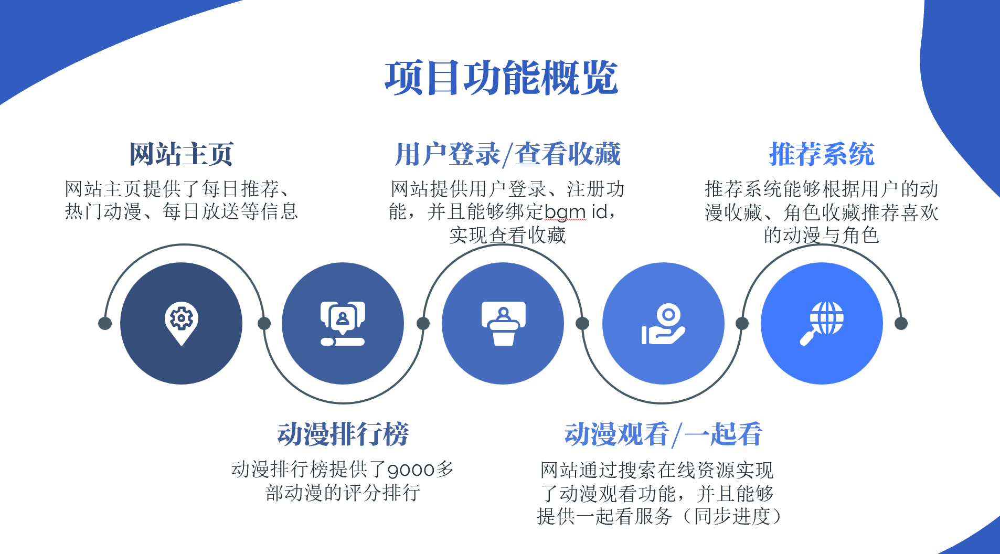
## 具体页面
### 主页
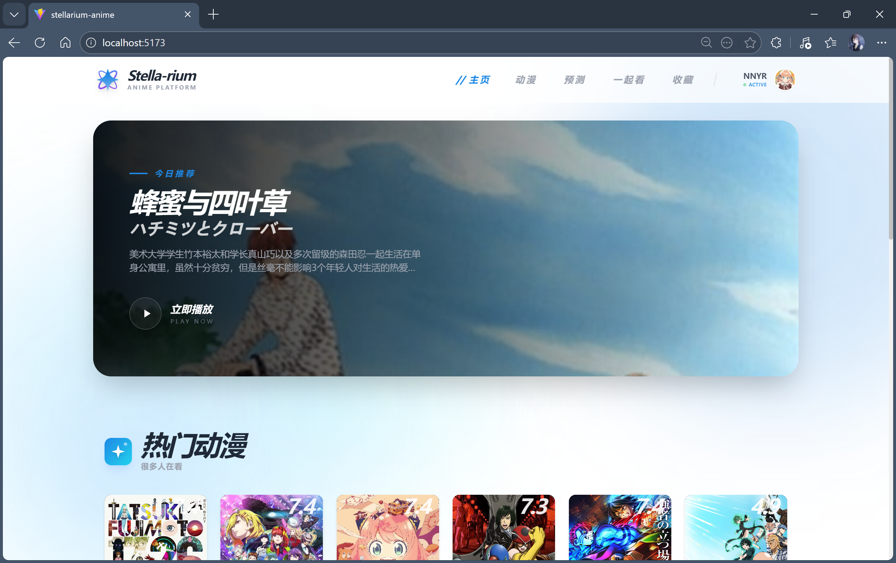
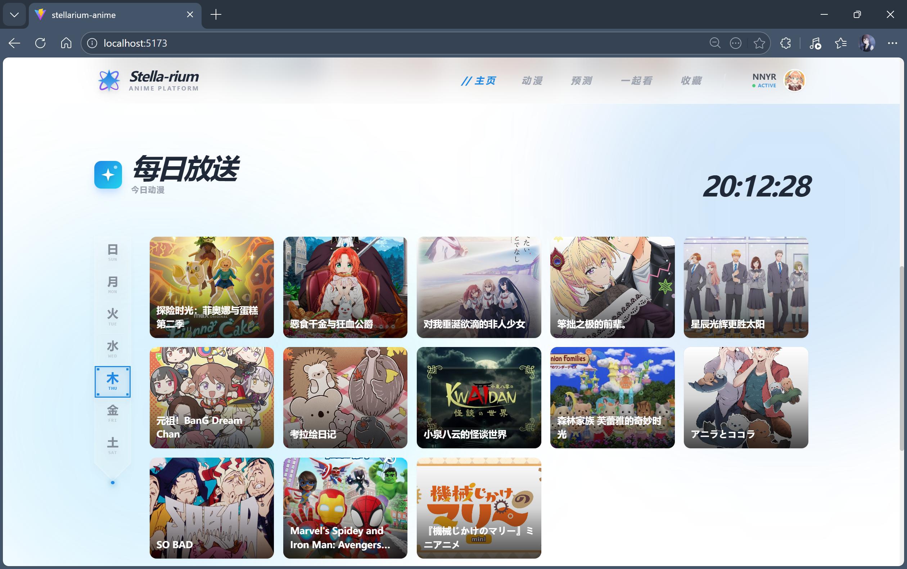
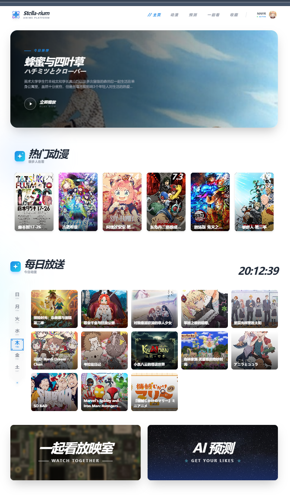
### 排行榜
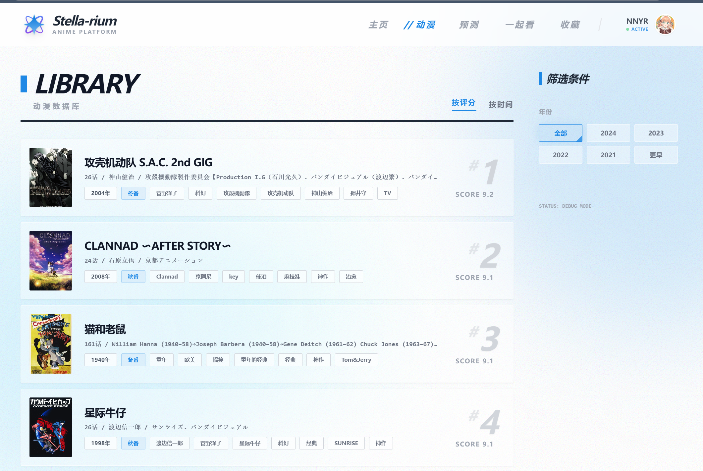
### 预测
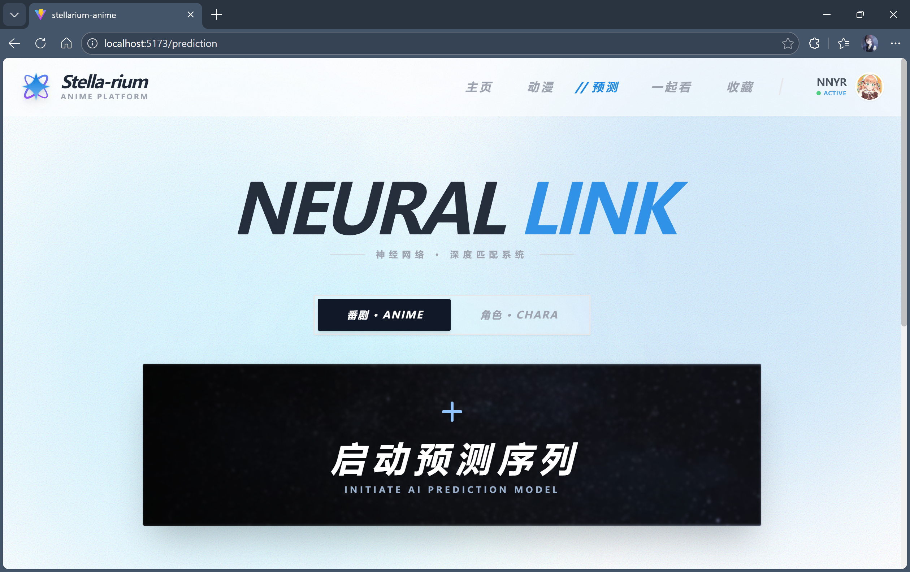
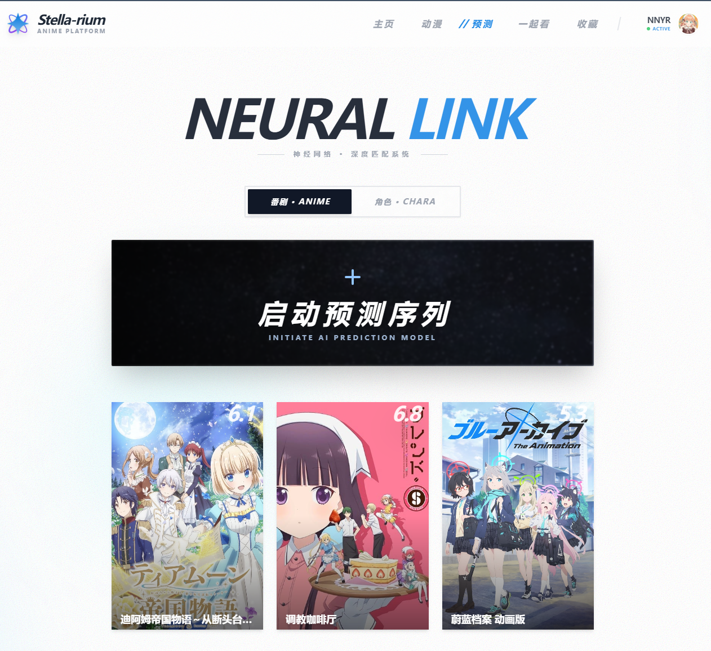
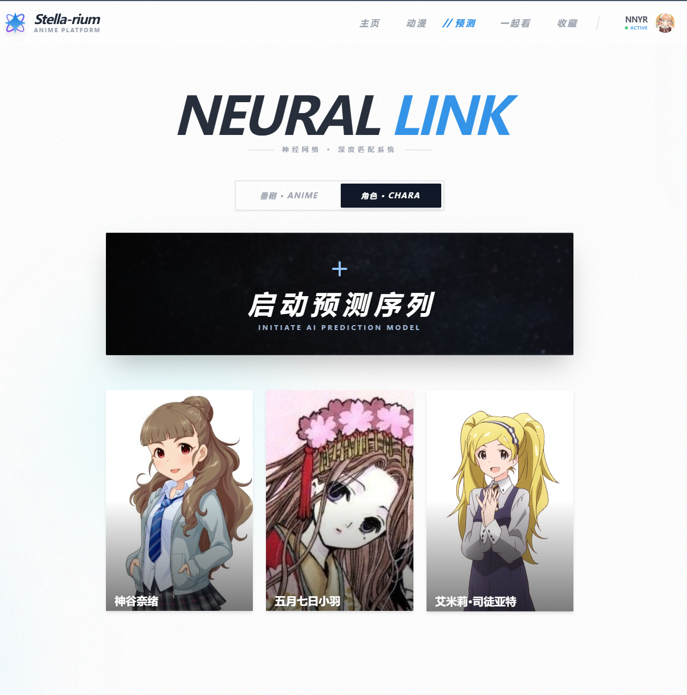
### 观看
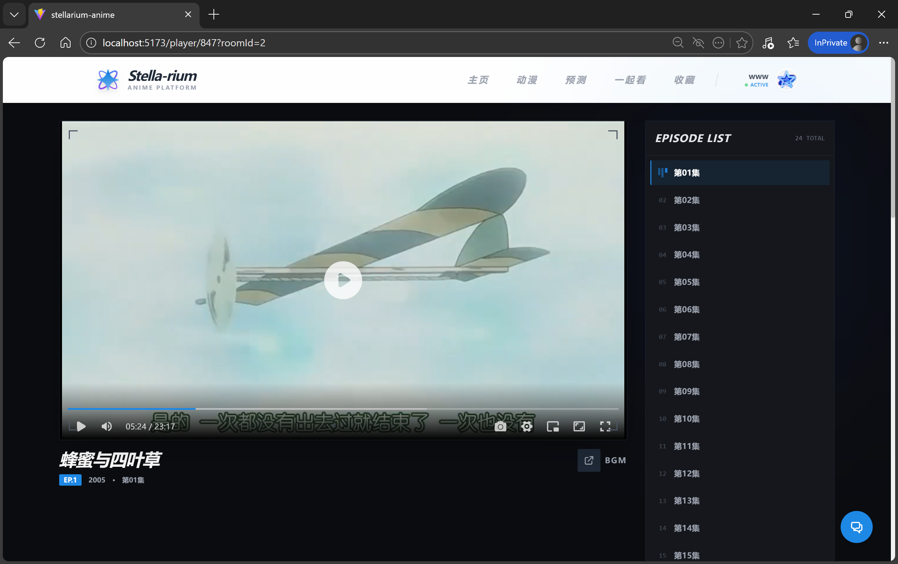
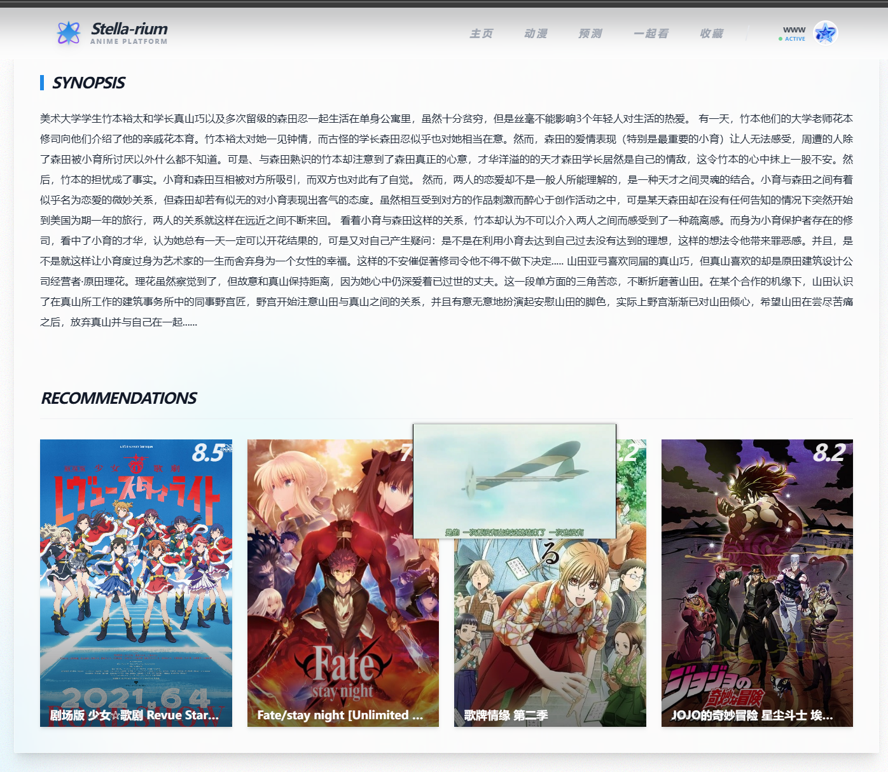
### 收藏
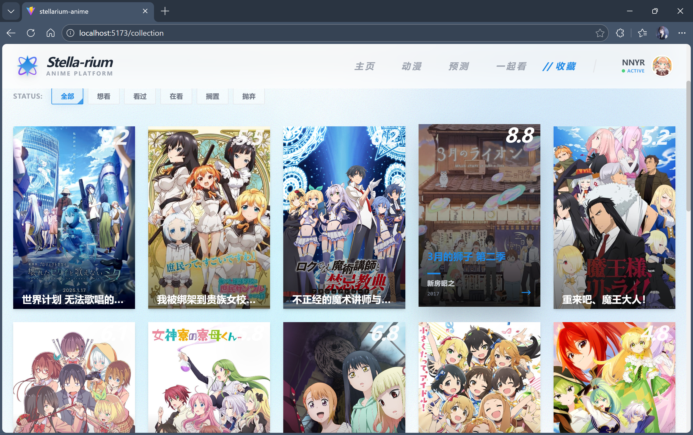
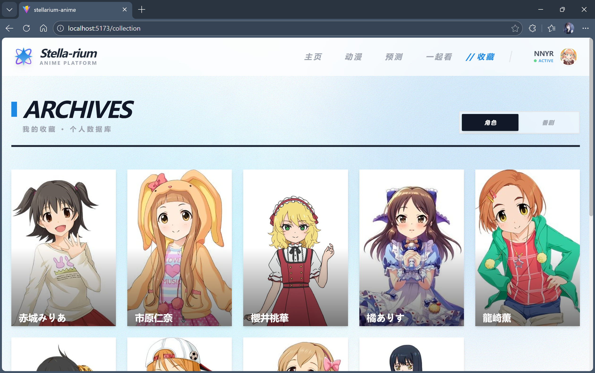
### 登录
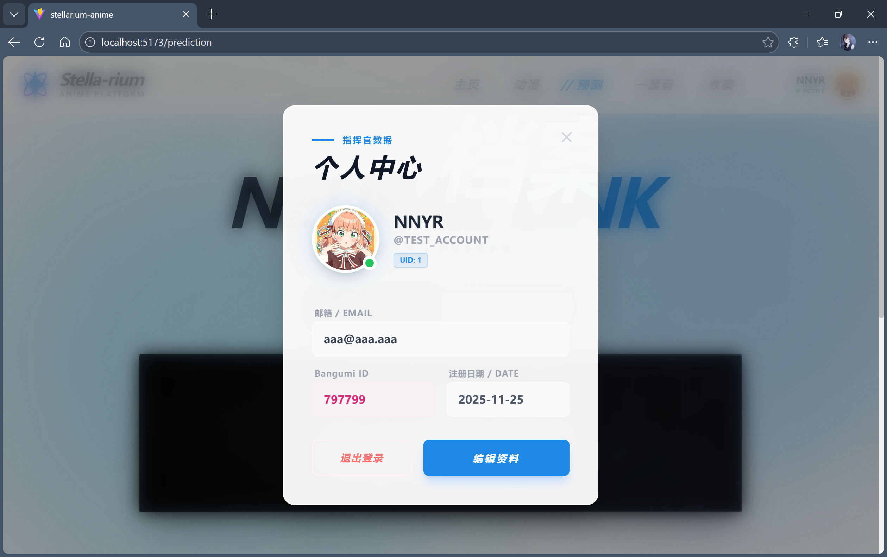
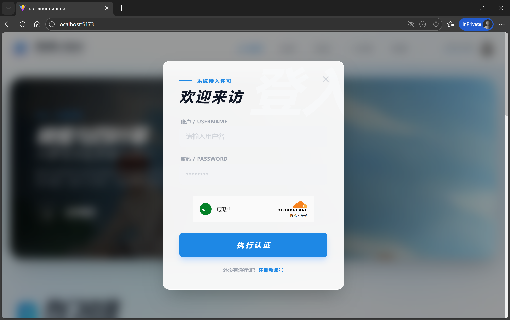

